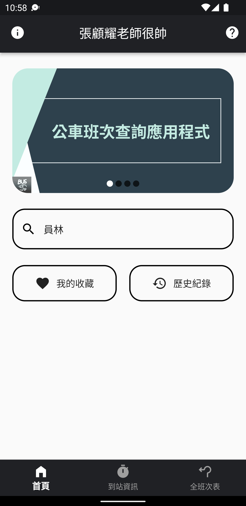
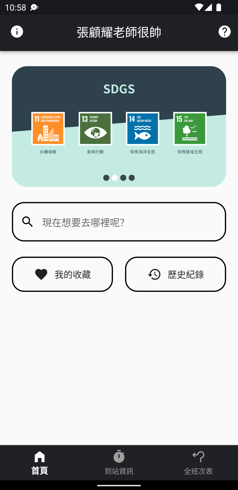
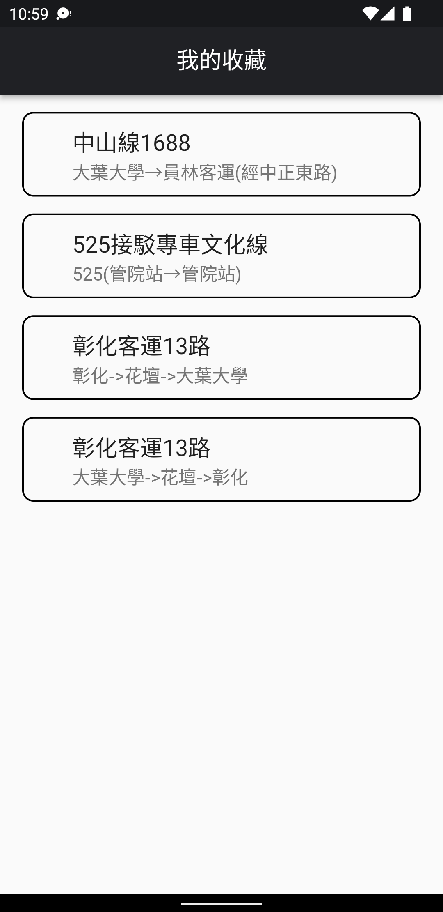
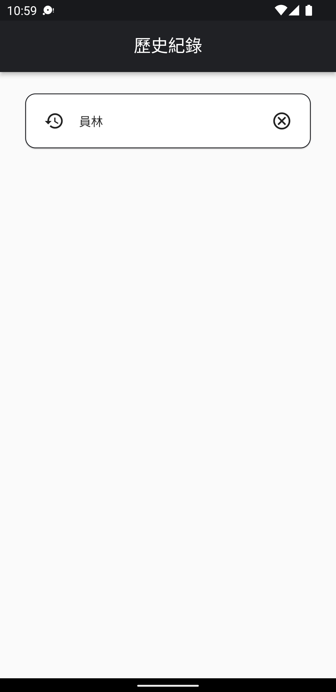
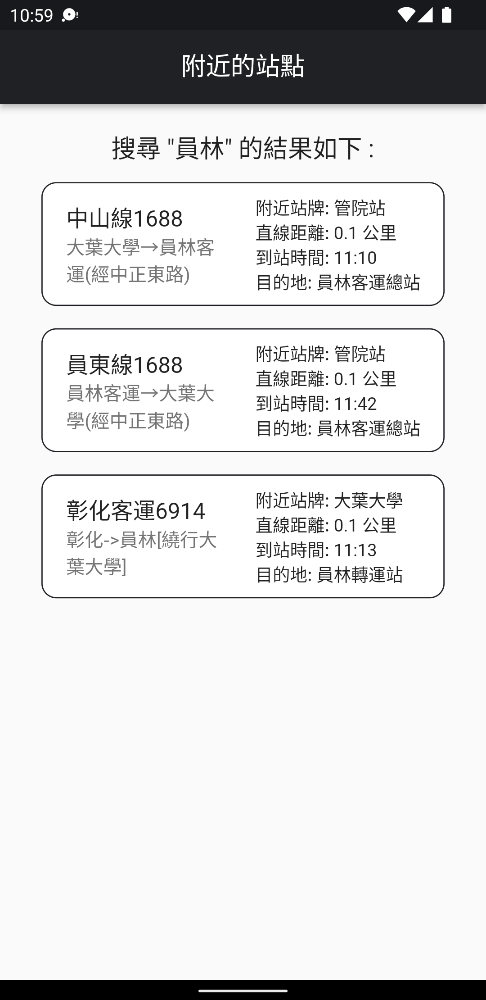
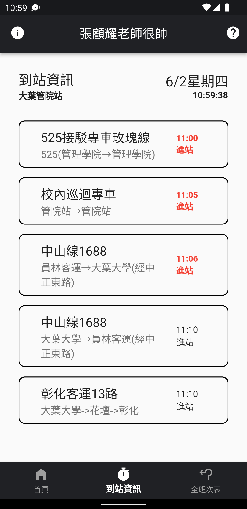
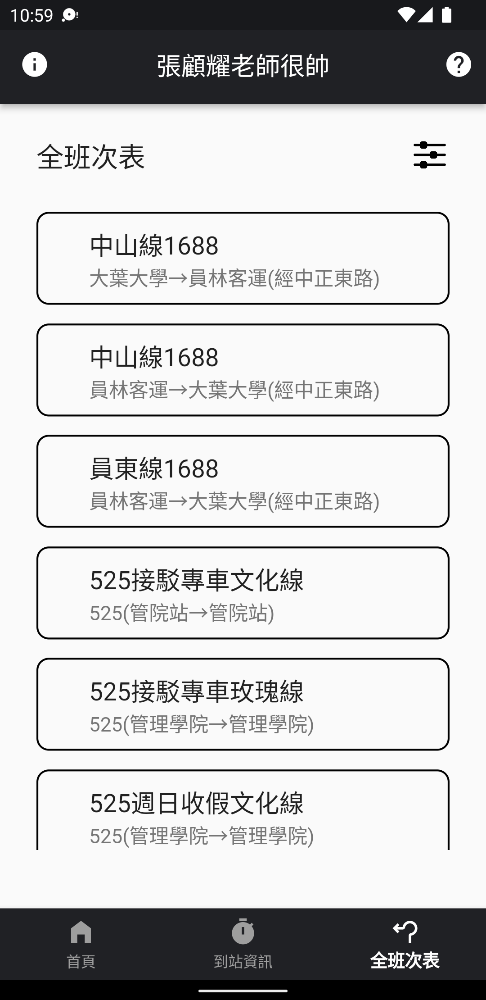
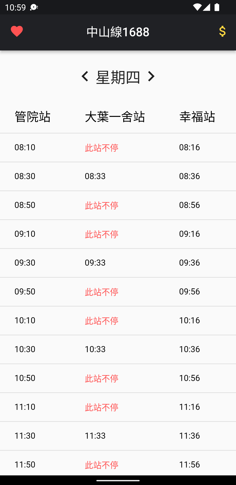

# DYU-Bus-App

### 大葉大學大一SDGS專題競賽，公車即時動態App製作。

**本專題使用的公車資料是由大葉大學電算中心與ptx平台所提供。**

**此 App 未經大葉大學電算中心授權故不會在 Play 商店 與 App Store 上架！**

**校外公車除發車時間以外，其他則是亂數填充的預估時間，非準確時間！！！**

開發理念: *一個主打介面簡約、操作直觀、功能齊全、注重使用者體驗的公車App。*

開發技術:
- Dart Language
- Flutter

相關介紹: 尚無

預覽:

